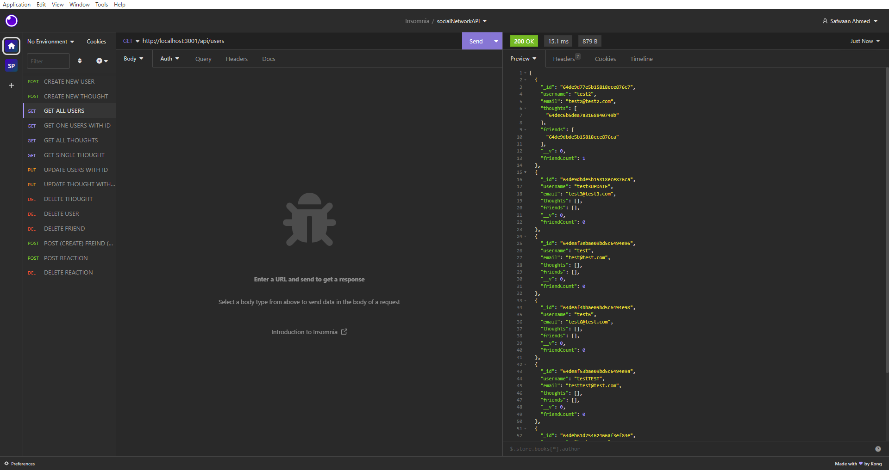

# Social Network API VIA MongoDB/MongooseDB

## Table Of Contents
- [Description](#description)
- [Use](#use)
- [License](#license)
- [Questions](#questions)
## Description
This project demonstrates how an effective backend works in conjuction with a proper Mongo database

## Use
Utilizing a backend with data being stored in a Mongo Database

## License
None

## Questions
If you have any questions, you can reach me at https://github.com/safwaan41   
 
or reach out to my email at safwaan41@gmail.com  
  
###  
 

## Screenshot
;

### 
    

 
